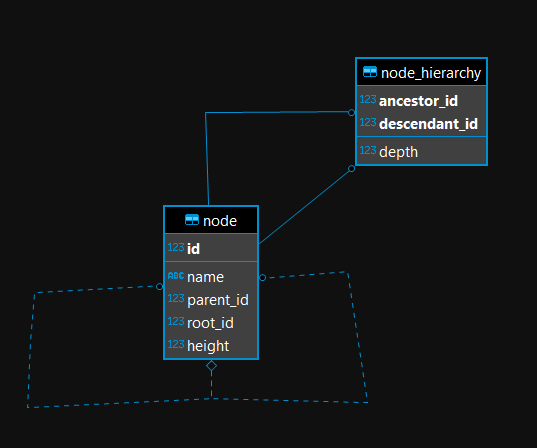

# Amazing API

## Install & run

Inside project's base folder run:

`docker-compose up`

## Application Structure

````
├── amazing-application
|       main & initialization, API controller and swagger configuration.
|
├── amazing-core
|      Main service of the application.
|      The logic for implementing the moving subtree query.
|      
|
├── amazing-domain
|       Contains the entities and the dtos of the application.
|       Models used throughout the application.
|
├── amazing-persistence
|       Database repositories.  
|
├── amazing-parent
|        Module used for dependency management of the application.
└──
````

## Database Structure
The schema of the database is:



### Table Entities 
```$xslt
* node (Node entity)
    - id
    - parent_id  // Many to One relation with the id of the same table node that shoes the parent of the node
    - root_id   // The id of root node, Many to One relation with the same table
    - name
    - height

* node_hierarchy (Hierararchy entity)
    - ancestor_id       //relation to id of node table that shows the ancestor 
    - descendant_id     //relation to id of node table that shows the descendant 
    - depth             //The hierarchy gap between ancestor and descendant 
```
The root node is stored in the node table without a parentId and with rootId = id

The id is numeric for debugging purposes. UUID type would be used in a production environment.

./Docker/amazing-db/init_scripts/import.sql script was used to initialize the Amazing database and store some sample data

## API

You can access swagger in order to use the api at:

http://localhost:8080/swagger-ui.html#/amazing-controller/

API calls:

*  Get all descendants of a node:

    `GET /nodes/descendants/{id}`
    
    path variable id : The id of the node whose descendants the user wants to get as a response
    
    ex.:` GET http://localhost:8080/nodes/descendants/0`

* Change parent of a node (move subTree)

    `PUT /nodes/{id}&parentId=?` 
    
    path variable id : The id of the node that user wants to move
    
    request parameter parentId : The id of the new parent Node that we want to move the node and it's subtree

    ex.:` PUT http://localhost:8080/nodes/3?parentId=2`
## Solution

In order to achieve high performance for the two queries the "Closure Tables" approach was followed.

A separate table (node_hierarchy) is used where all the hierarchy relationships are stored. 

With this approach the query which finds the descendants of a node was optimized. 

The query of moving a node and it's subtree is not optimal, but it is quite quick and a fair trade off considering the performance of the above query comparing to the other available solutions (adjacency list and nested sets)

The disadvantage of this approach is the extra space that is needed for the node_hierarchy, but in this solution the basic requirement was the time performance, so the storage size it was not considered.

## Testing

An Integration test for each API call was implemented. 
The tests are in AmazingControllerIntegrationTests in amazing-application module

It was a conscious decision not to implement any Unit test, because the service aren't complicated enough. So every case is covered with integration tests.

## Future steps

The next step in order to make this solution even better, is to cache the results of our queries in a redis cache. This is why I included a redis docker container in the docker-compose file.